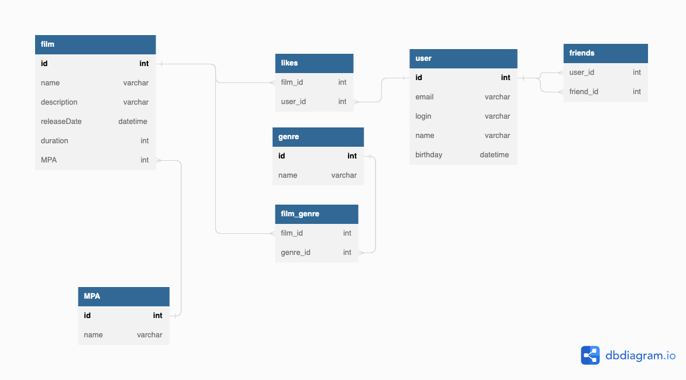

# java-filmorate
Template repository for Filmorate project.
# Схема связей таблиц


# Пояснение к таблицам
Таблица film содержит все данные об конкретном фильме. Лайки для фильма хранятся в отдельной таблицу likes. Поля в таблице likes указывают на конкретный фильм и конкретного пользователя, который поставил лайк. Таблица genre хранит все возможные жанры фильмов. Отдельная таблица film_genre хранит данные о жанрах конкретных фильмов.
Таблица user хранит данные о пользователях. Отдельная таблица friends устанавливает дружбу между пользователями. 

# Примеры получения данных

### SQL

#### Создание таблиц
``` sql
DROP TABLE IF EXISTS film_genre;
DROP TABLE IF EXISTS friends;
DROP TABLE IF EXISTS likes;
DROP TABLE IF EXISTS film;
DROP TABLE IF EXISTS MPA;
DROP TABLE IF EXISTS genre;
DROP TABLE IF EXISTS users;

CREATE TABLE IF NOT EXISTS MPA (
    id INTEGER GENERATED BY DEFAULT AS IDENTITY PRIMARY KEY,
    name varchar
);

CREATE TABLE IF NOT EXISTS film (
    id INTEGER GENERATED BY DEFAULT AS IDENTITY PRIMARY KEY,
    name varchar,
    description varchar,
    releaseDate timestamp,
    duration INTEGER,
    MPA INTEGER REFERENCES MPA(id) ON DELETE CASCADE
);

CREATE TABLE IF NOT EXISTS users (
    id INTEGER GENERATED BY DEFAULT AS IDENTITY PRIMARY KEY,
    email varchar,
    login varchar,
    name varchar,
    birthday timestamp
);

CREATE TABLE IF NOT EXISTS genre (
    id INTEGER GENERATED BY DEFAULT AS IDENTITY PRIMARY KEY,
    name varchar
);

CREATE TABLE IF NOT EXISTS likes (
    film_id INTEGER,
    user_id INTEGER,
    CONSTRAINT pk_likes PRIMARY KEY(film_id, user_id),
    CONSTRAINT fk_likes_film_id FOREIGN KEY(film_id) REFERENCES film(id) ON DELETE CASCADE,
    CONSTRAINT fk_likes_user_id FOREIGN KEY(user_id) REFERENCES users(id) ON DELETE CASCADE
);

CREATE TABLE IF NOT EXISTS film_genre (
    film_id INTEGER,
    genre_id INTEGER,
    CONSTRAINT pk_film_genre PRIMARY KEY(film_id, genre_id),
    CONSTRAINT fk_film_genre_film_id FOREIGN KEY(film_id) REFERENCES film(id) ON DELETE CASCADE,
    CONSTRAINT fk_film_genre_genre_id FOREIGN KEY(genre_id) REFERENCES genre(id)
);

CREATE TABLE IF NOT EXISTS friends (
    user_id INTEGER,
    friend_id INTEGER,
    CONSTRAINT pk_friends PRIMARY KEY(user_id, friend_id),
    CONSTRAINT fk_friends_user_id FOREIGN KEY(user_id) REFERENCES users(id) ON DELETE CASCADE,
    CONSTRAINT fk_friends_friend_id FOREIGN KEY(friend_id) REFERENCES users(id) ON DELETE CASCADE
);
 ```    

 #### Добавление данных

``` sql

INSERT INTO MPA (name) VALUES ('G');
INSERT INTO MPA (name) VALUES ('PG');
INSERT INTO MPA (name) VALUES ('PG-13');
INSERT INTO MPA (name) VALUES ('R');
INSERT INTO MPA (name) VALUES ('NC-17');

INSERT INTO genre (name) VALUES ('Комедия');
INSERT INTO genre (name) VALUES ('Драма');
INSERT INTO genre (name) VALUES ('Мультфильм');
INSERT INTO genre (name) VALUES ('Триллер');
INSERT INTO genre (name) VALUES ('Документальный');
INSERT INTO genre (name) VALUES ('Боевик');

INSERT INTO film (name, description, releaseDate, duration, MPA) VALUES ('The Gentlemen', 'description', '2019-01-01', 2, 4);
INSERT INTO film (name, description, releaseDate, duration, MPA) VALUES ('Lock, Stock and Two Smoking Barrels', 'description', '1998-01-01', 2, 4);
INSERT INTO film (name, description, releaseDate, duration, MPA) VALUES ('Snatch', 'description', '2000-01-01', 1, 5);
INSERT INTO film (name, description, releaseDate, duration, MPA) VALUES ('Tais-toi!', 'description', '2003-01-01', 2, 2);
INSERT INTO film (name, description, releaseDate, duration, MPA) VALUES ('Le grand blond avec une chaussure noire', 'description', '1972-01-01', 2, 1);

INSERT INTO users (email, login, name, birthday) VALUES ('user1@yandex.ru', 'user1_login', 'user1', '1995-01-01');
INSERT INTO users (email, login, name, birthday) VALUES ('user2@yandex.ru', 'user2_login', 'user2', '2000-01-01');
INSERT INTO users (email, login, name, birthday) VALUES ('user3@yandex.ru', 'user3_login', 'user3', '2005-01-01');
INSERT INTO users (email, login, name, birthday) VALUES ('user4@yandex.ru', 'user4_login', 'user4', '2010-01-01');
INSERT INTO users (email, login, name, birthday) VALUES ('user5@yandex.ru', 'user5_login', 'user5', '2015-01-01');

INSERT INTO film_genre (film_id, genre_id) VALUES (1, 1);
INSERT INTO film_genre (film_id, genre_id) VALUES (1, 4);
INSERT INTO film_genre (film_id, genre_id) VALUES (2, 1);
INSERT INTO film_genre (film_id, genre_id) VALUES (3, 2);
INSERT INTO film_genre (film_id, genre_id) VALUES (4, 1);
INSERT INTO film_genre (film_id, genre_id) VALUES (4, 4);
INSERT INTO film_genre (film_id, genre_id) VALUES (5, 1);
INSERT INTO film_genre (film_id, genre_id) VALUES (5, 4);

INSERT INTO likes (film_id, user_id) VALUES (1, 1);
INSERT INTO likes (film_id, user_id) VALUES (1, 2);
INSERT INTO likes (film_id, user_id) VALUES (1, 3);
INSERT INTO likes (film_id, user_id) VALUES (2, 1);
INSERT INTO likes (film_id, user_id) VALUES (2, 5);
INSERT INTO likes (film_id, user_id) VALUES (3, 4);
INSERT INTO likes (film_id, user_id) VALUES (4, 1);

INSERT INTO friends (user_id, friend_id) VALUES (1, 2);
INSERT INTO friends (user_id, friend_id) VALUES (2, 1);
INSERT INTO friends (user_id, friend_id) VALUES (1, 3);
INSERT INTO friends (user_id, friend_id) VALUES (3, 1);
INSERT INTO friends (user_id, friend_id) VALUES (2, 3);
INSERT INTO friends (user_id, friend_id) VALUES (3, 2);
INSERT INTO friends (user_id, friend_id) VALUES (1, 5);
INSERT INTO friends (user_id, friend_id) VALUES (5, 2);
INSERT INTO friends (user_id, friend_id) VALUES (2, 4);
INSERT INTO friends (user_id, friend_id) VALUES (3, 4);
 ```  